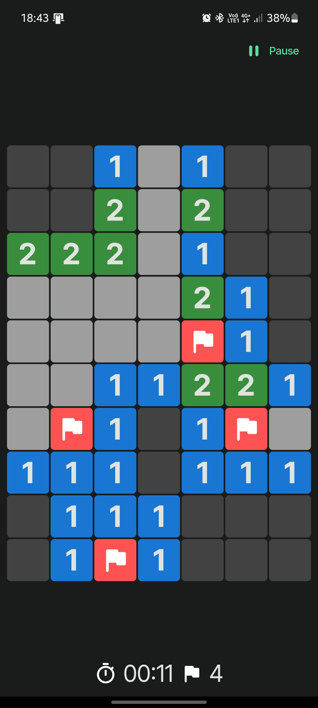

# minesweeper

The classic [Minesweeper](https://en.wikipedia.org/wiki/Minesweeper_(video_game)) game built using [Flutter](https://flutter.dev).

(Tested on Android, Windows, and the Web)

## Installing
Android:
Windows: 
Web

## How to play
The game has an instructions section but if you'd like you can understand how to play here:
- __To open a cell:__ Simply tap/click.
- __To flag a cell:__ Swipe up/down for mobile and right-click for desktop.

To learn how the game works visit [here](https://en.wikipedia.org/wiki/Minesweeper_(video_game)#Gameplay).
## Screenshots
 
